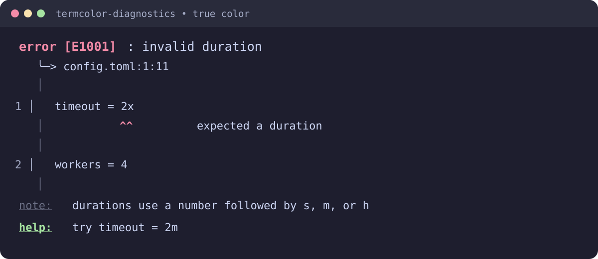
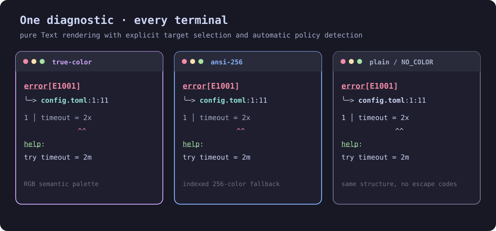

# termcolor-diagnostics

Source-annotated diagnostics and rich error reporting for Lean 4 command-line tools.

termcolor-diagnostics keeps diagnostic data separate from terminal IO. A diagnostic contains
source spans, labels, notes, and help text; rendering returns TermColor.Text, so callers can
choose plain output, ANSI-16, ANSI-256, or true color with the existing termcolor stack.

## Install

Add the package to `lakefile.lean`:

~~~lean
require «termcolor-diagnostics» from git
  "https://github.com/jonaprieto/lean-termcolor-diagnostics.git"
  @ "v0.1.8"
~~~

## Quick start

~~~lean
import TermColor.Diagnostics
import TermColor.Detect

open TermColor
open TermColor.Diagnostics

def sources : Sources :=
  #[Source.named "settings.toml" "timeout = 2x"]

def clickableSources : Sources :=
  #[Source.named "settings.toml" "timeout = 2x" |>.withUri "file:///tmp/settings.toml"]

def diagnostic : Diagnostic :=
  (Diagnostic.error "invalid duration")
    |>.withCode "E1001"
    |>.withLabel (Label.primary (Span.range 0 10 12) "expected a duration")
    |>.withHelp "try timeout = 2m"

#eval Text.render RenderTarget.plain (render sources diagnostic)

-- Set both options when the terminal supports OSC-8 hyperlinks.
#eval Text.render (RenderTarget.withHyperlinks RenderTarget.trueColor)
  (render clickableSources diagnostic { hyperlinks := true })
~~~

The pure renderer produces a source annotation such as:

~~~text
error [E1001]: invalid duration
  ╰─> settings.toml:1:11
   │
1 │ timeout = 2x
  │           ^^ expected a duration
   │
help: try timeout = 2m
~~~

For terminal output, pass the returned Text to TermColor.print or
TermColor.Terminal.writeText. Terminal detection remains outside this package.

## Model

Spans use UTF-8 byte offsets and half-open ranges. This matches byte-oriented parsers such as
grip and avoids repeatedly converting parser positions into line and column pairs.

~~~lean
structure Source where
  name : String
  text : String

structure Span where
  source : SourceId
  start : Nat
  stop : Nat

structure Label where
  span : Span
  kind : LabelKind
  message : String
~~~

Line numbers and display columns are derived while rendering. Tabs use configurable tab stops;
Unicode display width is supplied by termcolor-layout. Byte-oriented callers can use
`Source.fromBytes`; invalid UTF-8 is rendered as `�` instead of aborting the diagnostic.

## Features

- primary and secondary labels;
- single-line and multiline source spans;
- multiple source files and diagnostics;
- configurable width, context lines, tab width, and ASCII/Unicode decorations;
- ANSI-16, ANSI-256, true-color, and plain render targets;
- color-scheme-highlighted filenames and opt-in OSC-8 source locations;
- notes and help messages;
- semantic palettes from ColorScheme.catppuccin, dracula, and monokai;
- CRLF, empty-source, EOF, point-span, and invalid-UTF-8 handling;
- pure Text output with existing ANSI and non-TTY policies;
- separate machine-checked properties and executable rendering tests.

## Package stack

~~~text
termcolor
  -> termcolor-layout
      -> termcolor-diagnostics
      -> termcolor-widgets
  -> termcolor-terminal
  -> argus
~~~

The diagnostics renderer depends on styled text and layout, not terminal IO. argus uses it for
structured command-line errors, while grip remains independent of terminal packages.

The demo is a feature gallery: `lake exe demo` shows errors, warnings, notes, help severity,
primary and secondary labels, multiline and multi-source spans, tabs, CJK and combining text,
CRLF, empty and EOF spans, invalid UTF-8 fallback, width truncation, ANSI-16/256/true-color
targets, custom palettes, batched diagnostics, plain output, clickable OSC-8 locations, and
auto-detected output. The
`detect` executable exercises terminal policy independently:

~~~sh
env -u NO_COLOR -u FORCE_COLOR TERM=xterm lake exe detect plain
env -u NO_COLOR FORCE_COLOR=1 TERM=xterm lake exe detect ansi16
env -u NO_COLOR FORCE_COLOR=1 TERM=xterm-256color lake exe detect ansi256
env -u NO_COLOR FORCE_COLOR=1 TERM=xterm COLORTERM=truecolor lake exe detect truecolor
env -u NO_COLOR -u FORCE_COLOR TERM=dumb lake exe detect plain
~~~

Argus consumes the same structured model through its `Help.renderErrors` integration, preserving
parser error accumulation while adding source-annotated output. See the
[Argus demo](https://github.com/jonaprieto/lean-argus/blob/main/examples/Demo.lean).

## Development

~~~sh
lake build TermColor.Diagnostics TermColor.Diagnostics.Properties tests detect readme demo
lake exe tests
lake exe detect plain
python3 scripts/check-axioms.py
python3 scripts/style-check.py
lake exe demo
~~~

TermColor.Diagnostics.Properties is separate from the runtime package. The properties package
checks span and source-indexing laws; executable tests cover the complete visual layout and
Unicode cases. The CI workflow runs the same audit on every push and pull request. The detailed
coverage checklist is in [docs/COVERAGE.md](docs/COVERAGE.md). CI uses the repository secret
`ECOSYSTEM_READ_TOKEN` when present to clone the private `lean-termcolor` and
`lean-termcolor-layout` repositories; it falls back to the default GitHub token for public forks.

## Limitations

The current release does not include fix-it edits, JSON/SARIF output, or syntax highlighting.
OSC-8 links require an absolute URI and a terminal that supports OSC-8; plain and ordinary ANSI
targets keep the location readable while suppressing the hyperlink sequence.
Display width is code-point based: combining marks and common wide characters are handled, but
full grapheme-cluster shaping and terminal-specific font behavior are outside the layout layer.
The source-span convention is stable so these features can be added without changing parser
positions.

## License

Apache-2.0.
