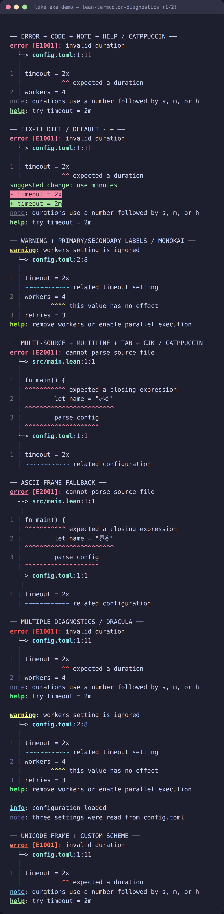

# termcolor-diagnostics

[](https://github.com/jonaprieto/lean-termcolor-diagnostics/actions/workflows/ci.yml)
[](https://github.com/jonaprieto/lean-termcolor-diagnostics/releases)
[](lean-toolchain)
[](https://jonaprieto.github.io/lean-termcolor-diagnostics/)
[](LICENSE)

Pure source-annotated diagnostics for Lean 4 command-line tools. A diagnostic renders to
`TermColor.Text`; terminal IO remains outside the package.

<p align="center"></p>

## Install

```lean
require termcolor-diagnostics from git
  "https://github.com/jonaprieto/lean-termcolor-diagnostics.git" @ "v0.1.14"
```

## Quick start

```lean
import TermColor.Diagnostics
import TermColor.Detect

open TermColor TermColor.Diagnostics

def sources : Sources := #[Source.named "settings.toml" "timeout = 2x"]

def diagnostic : Diagnostic :=
  (Diagnostic.error "invalid duration")
    |>.withCode "E1001"
    |>.withLabel (Label.primary (Span.range 0 10 12) "expected a duration")
    |>.withFixIt { span := Span.range 0 10 12, replacement := "2m" }
    |>.withHelp "try timeout = 2m"

#eval Text.render RenderTarget.plain (render sources diagnostic)
```

The model supports source spans, primary and secondary labels, notes, help, fix-its, multiple
files, configurable context and width, color schemes, plain output, and optional OSC-8 links.
Offsets are UTF-8 byte positions, matching byte-oriented parsers such as Grip.

## Build

```sh
lake build TermColor.Diagnostics TermColor.Diagnostics.Properties tests detect readme demo
lake exe tests
lake exe demo
```

## Related projects

[`grip-diagnostics`](https://github.com/jonaprieto/lean-grip-diagnostics) adapts Grip parse errors;
[`argus`](https://github.com/jonaprieto/lean-argus) uses the renderer for command-line errors.

## License

Apache-2.0.
